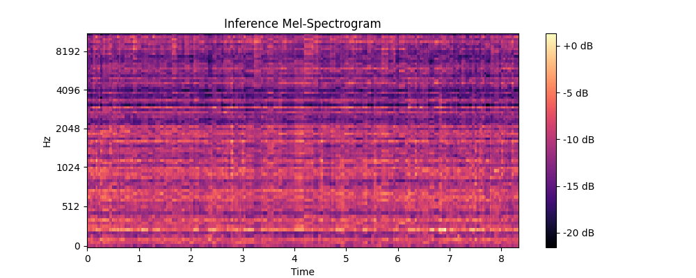
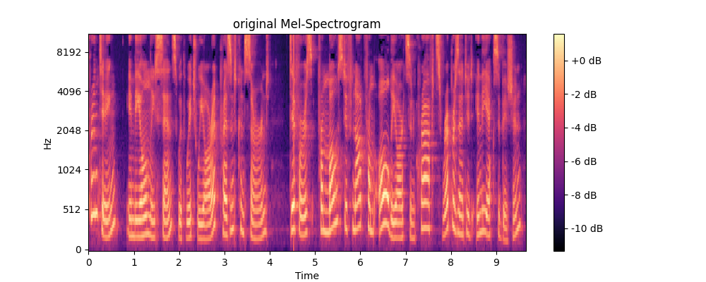

# FastSpeech 2 Implementation with RPE + Absolute Positional Encoding

This is an implementation of FastSpeech 2 with some modifications, specifically incorporating Relative Positional Encoding (RPE) along with Absolute Positional Encoding. The model is designed for Text-to-Speech synthesis.

## Model Architecture

- Base Architecture: FastSpeech 2
- Positional Encoding: 
  - Absolute Positional Encoding
  - Relative Positional Encoding (RPE)
- Variance Adaptor Components:
  - Duration Predictor
  - Pitch Predictor
  - Energy Predictor

## Current Status

The model is currently in development phase and requires further tuning. While the basic architecture is implemented, there are still some aspects that need improvement:

1. Mel-spectrogram generation quality
2. Audio synthesis clarity
3. Variance predictor fine-tuning

### Sample Output

Below are sample mel-spectrograms showing the current output compared to ground truth:

#### Current Model Output


#### Ground Truth


As visible from the spectrograms, while the model is generating structured output, there's still room for improvement in terms of:
- Frequency resolution
- Temporal consistency
- Overall spectrogram quality

## TODO

- [ ] Fine-tune variance predictors (duration, pitch, energy)
- [ ] Optimize normalization parameters
- [ ] Improve mel-spectrogram quality
- [ ] Add more training data
- [ ] Experiment with different hyperparameters

## Dataset

The model is trained on the LJSpeech dataset.

## Dependencies

- PyTorch
- numpy
- librosa
- matplotlib
- soundfile

## Training

```bash
python train.py
```

## Inference

```bash
python inference.py
```

## Notes

This implementation is still experimental and requires further optimization. The current results show that while the basic architecture is working, additional tuning is needed to achieve production-quality speech synthesis.

## Acknowledgments

This implementation is based on the FastSpeech 2 paper: "FastSpeech 2: Fast and High-Quality End-to-End Text to Speech"
